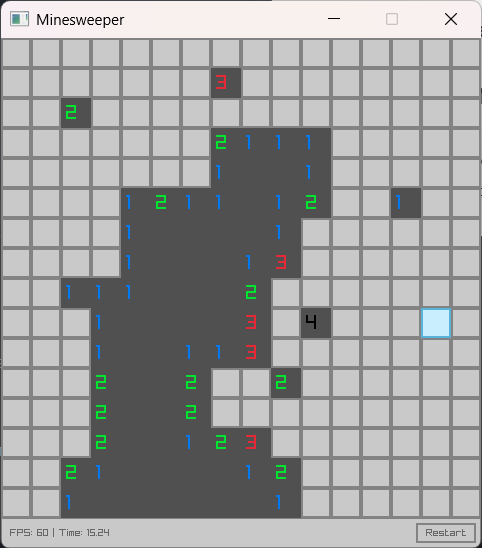

# 🧨 Minesweeper

A classic **Minesweeper** game built using **Go** and the **[Raylib](https://www.raylib.com/)** game development library.



### 📥 Clone and Run

```bash
git clone https://github.com/KonyD/minesweeper.git
cd minesweeper-go-raylib
go run main.go
```

### 🏗️ Building the Game

##### 🪟 Windows (with MinGW or TDM-GCC)
```bash
go build -ldflags "-H=windowsgui" -o minesweeper.exe main.go
```

##### 🐧 Linux

```bash
go build -o minesweeper main.go
```

##### 🍏 macOS

```bash
go build -o minesweeper main.go
```